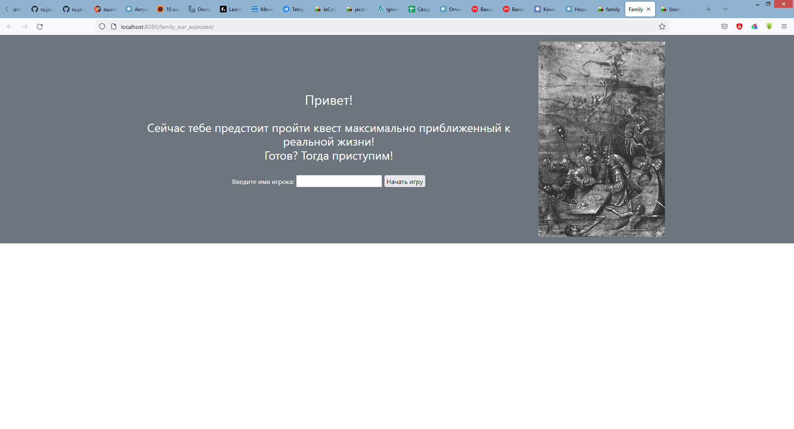
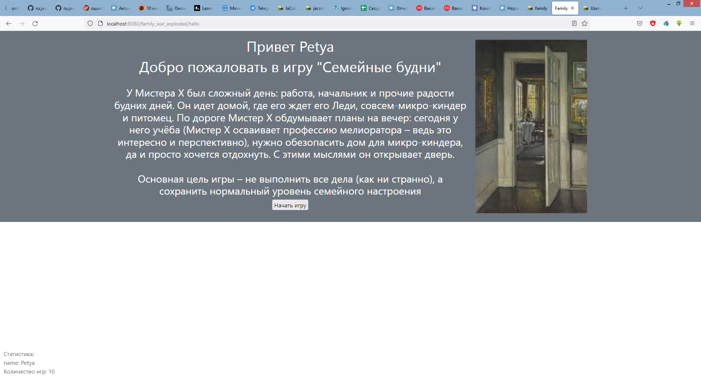
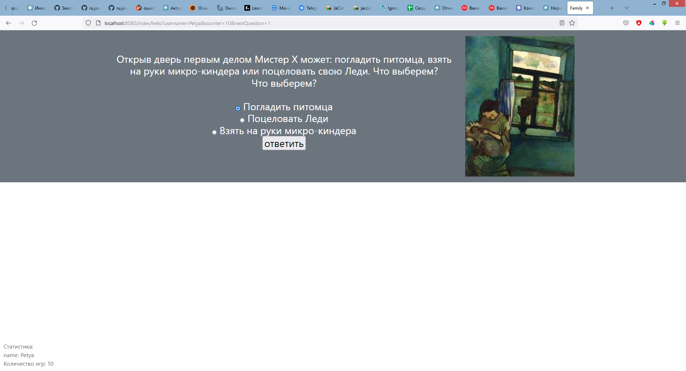
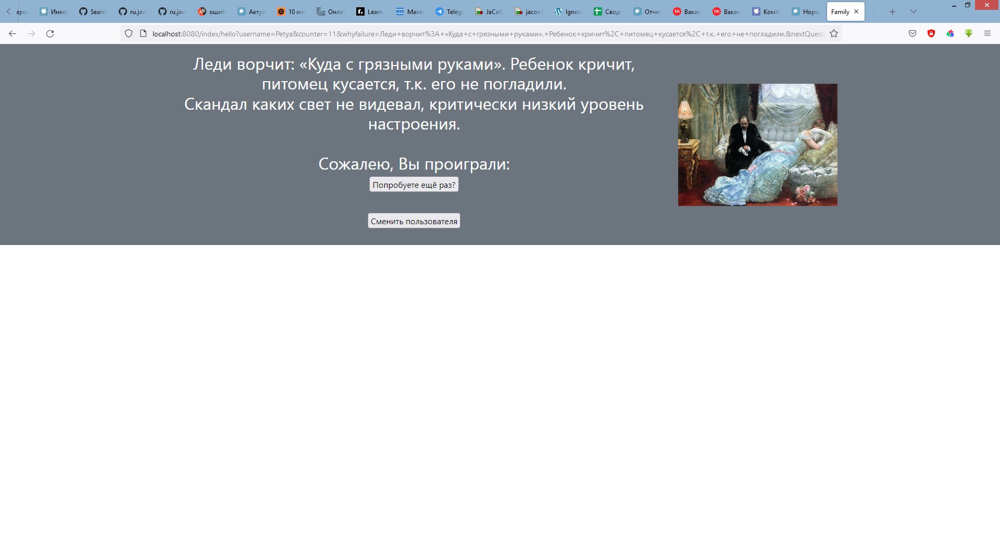

# Квест-игра "Семейная жизнь"

1. Все персонажи и события, несмотря на очевидную связь с реальностью, являются полностью вымышленными.
   И, в силу своего содержания, вообще не предназначен для игры.))
2. Запускается на Tomcat 9.0.65
3. Для корректной работы прописать в Tomcat Application context - /index
3. Ветвление в квесте простое - на правильные и не правильные ответы. 
4. Все правильные ведут к следующему вопросу
5. Все не правильные к окончанию игры с указанием причины почему проиграли
6. После окончания игры возможно начать заново, либо сменить пользователя
7. Роль пользователя присутствует, но не реализована - все пользователи заводятся как игроки

